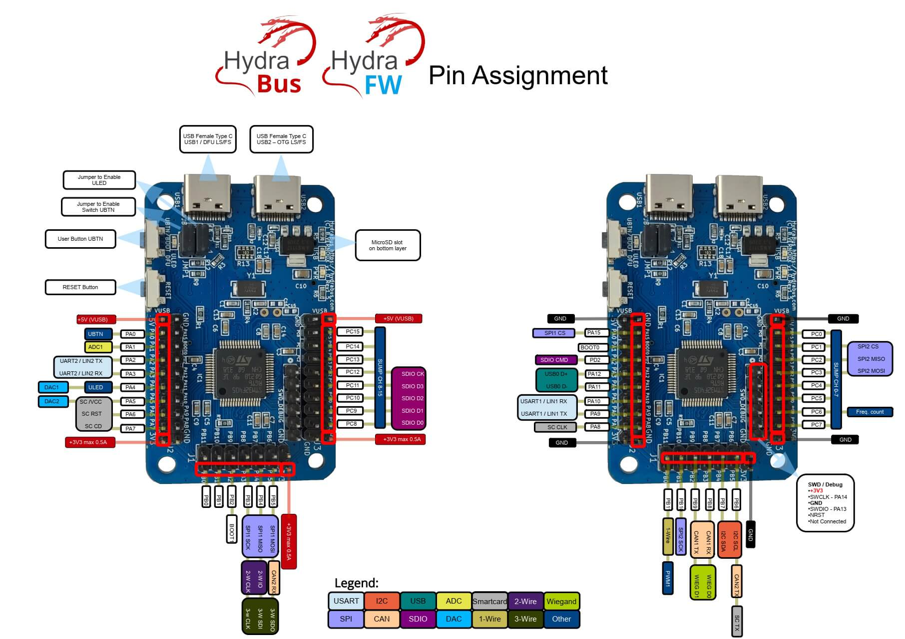

# HydraBus




## Features

Support many extensions:

- HydraNFC
- HydraFlash
- HydraLINCAN

External interactions:

- UART
- I2C
- CAN/LIN Bus
- SUMP
- JTAG
- SPI Bus
- SD/SDIO
- USB Bus
- ADC / DAC (Analog / Digital)
- GPIO
- NFC
- Wiegand
- NAND flash
- 1-wire,2-wire,3-wire


## Firmware

* [hydrabus/hydrafw](https://github.com/hydrabus/hydrafw) - HydraFW official firmware for HydraBus/HydraNFC
* [hydrabus/hydrafw_hydranfc_shield_v2](https://github.com/hydrabus/hydrafw_hydranfc_shield_v2) - HydraFW dedicated to HydraBus v1 / HydraNFC Shield v2
* [bvernoux/blackmagic](https://github.com/bvernoux/blackmagic) - In application debugger for ARM Cortex microcontrollers


## Commands

* Basic info: `show system`
    ```ps1> show system
    HydraFW (HydraBus) v0.11-1-g4d74500 2023-05-09
    sysTime: 0x000d82dd.
    cyclecounter: 0x76ac02b9 cycles.
    cyclecounter64: 0x0000000076ac02cb cycles.
    10ms delay: 1680035 cycles.
    ```

* Determine the port name: `ls -l /dev/tty*`
* Interact witht the HydraBus: `screen /dev/ttyACM0`
* Switch to SPI mode: `spi`
* Determine the pin for SPI: `show pins`


## Syntax

| Value | Description |
|-------|-------------|
| [	 | Chip select (CS) active (low) |
| ]	 | CS disable (high) |
| r	 | Read one byte by sending dummy byte (0xff). r:1...255 for bulk reads |
| hd | Read one byte by sending dummy byte (0xff). hd:1...4294967295 for bulk reads. Displays a hexdump of the result |
| w	 | Followed by values to write byte(s). w:1...255 for bulk writes |
| 0b | Write this binary value. Format is 0b00000000 for a byte, but partial bytes are also fine: 0b1001 |
| 0	 | Write this Octal value. Format is prefixed by a 0 (values from 000 to 077) |
| "  | Write an ASCII-encoded string |
| 0h/0x | Write this HEX value. Format is 0h01 or 0x01. Partial bytes are fine: 0xA. A-F can be lower-case or capital letters |
| 0-255	| Write this decimal value. Any number not preceded by 0x, 0h, or 0b is interpreted as a decimal value |

Examples:

* Read Identification (0x9F): `[ 0x9F r:3 ]`
* Read Data (0x03) at the address (0x00:3) and read 32 bytes (hd:32) `[ 0x03 0x00:3 hd:32 ]`


## References

* [HydraBus/HydraFW wiki - Benjamin Vernoux - Jan 21, 2021](https://github.com/hydrabus/hydrafw/wiki/)
* [HydraBus v1.0 Specifications - HydraBus](https://hydrabus.com/hydrabus-1-0-specifications)
* [HydraBus Assembly Video - Lab401 - 30 may 2017](https://youtu.be/9lFEPG8EG6w)
* [BlackAlps17: Hydrabus: Lowering the entry fee to the IoT bugfest - Benjamin Vernoux -  2 dec. 2017](https://www.youtube.com/watch?v=theYbzPhYH8)
* [HydraBus - An Open Source Platform - RMLL Sec 2017](https://archives.pass-the-salt.org/RMLL%20Security%20Tracks/2017/slides/RMLL-Sec-2017-hydrabus.pdf)
* [Ph0wn, my first IoT CTF - Part 3 - Sebastien Andrivet - Dec. 19, 2018](https://sebastien.andrivet.com/en/posts/ph0wn-my-first-iot-ctf-part-3/)